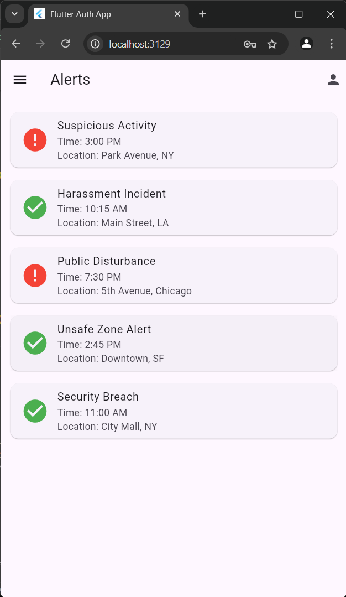
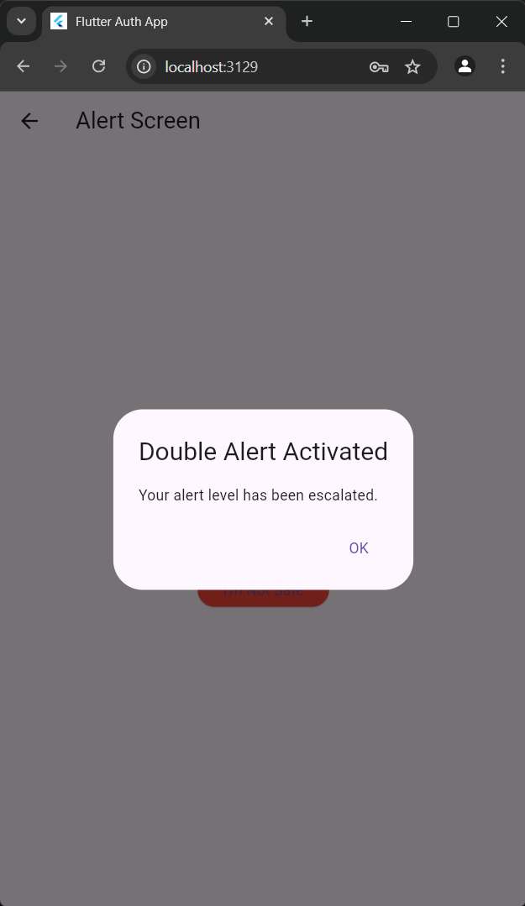
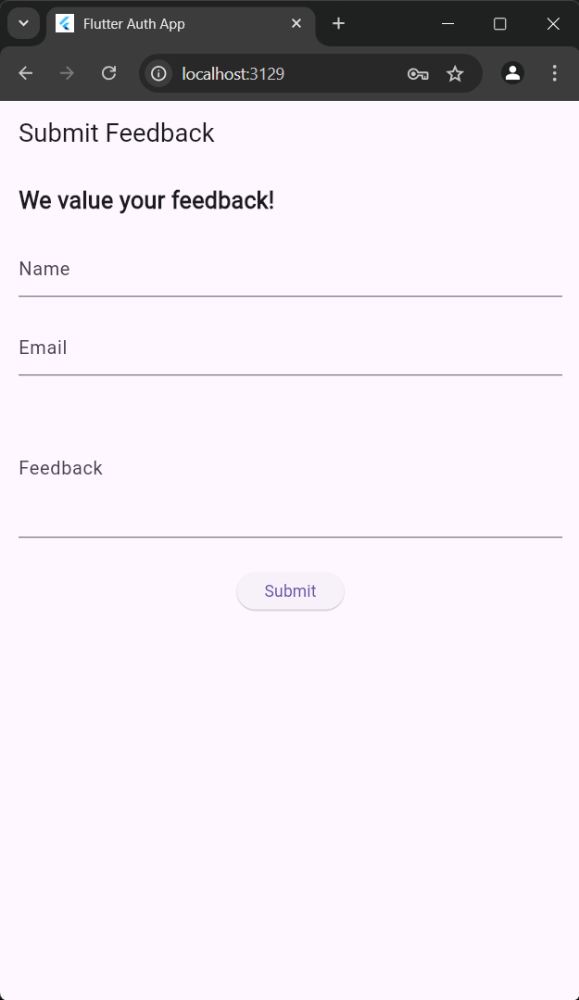
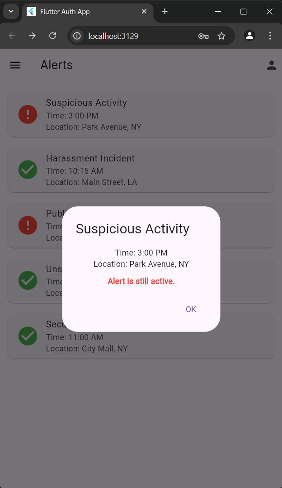
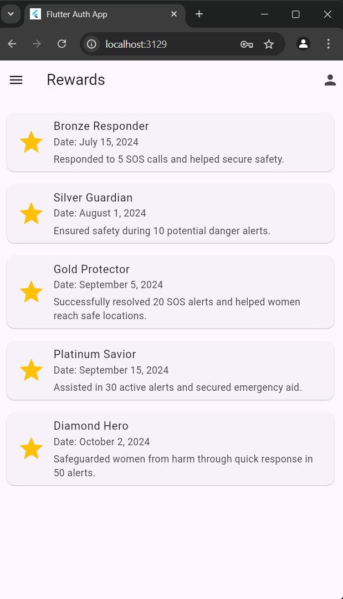

# She-Secure App

**She-Secure** is a safety and awareness app designed to help women in dangerous or emergency situations. The app provides features such as instant SOS alerts, safety awareness campaigns, rewards for safe behavior, and feedback collection. It aims to provide users with quick access to help and resources when needed, enhancing their sense of security.

## Table of Contents

- [Features](#features)
- [Getting Started](#getting-started)
- [Installation](#installation)
- [Usage](#usage)
- [Project Structure](#project-structure)
- [Screenshots](#screenshots)
- [Technologies Used](#technologies-used)
- [Contributing](#contributing)
- [License](#license)

## Features

- **SOS Alerts**: Quick access to an alert button that sends out an SOS signal.
- **Profile Management**: View and edit user profile details such as name, email, phone number, gender, and date of birth.
- **Safety Awareness**: Access safety awareness campaigns and resources.
- **Rewards System**: Earn rewards for safe behavior and participation in awareness programs.
- **Feedback**: Collect user feedback to improve the app and the experience.

## Getting Started

### Prerequisites

- [Flutter SDK](https://flutter.dev/docs/get-started/install)
- Android/iOS Emulator or a physical device for testing

### Installation

1. **Clone the repository**:
   ```bash
   git clone https://github.com/Srihari-Prasath/she-secure-app.git
   ```
2. **Navigate to the project directory**:
   ```bash
   cd she-secure-app
   ```
3. **Install dependencies**:
   ```bash
   flutter pub get
   ```

### Running the App

1. **Launch the app on an emulator or connected device**:
   ```bash
   flutter run
   ```

## Usage

1. **Home Screen**: The central dashboard of the app where you can trigger an SOS alert.
2. **Profile Page**: Manage and view personal information such as name, email, phone number, and more.
3. **Drawer Navigation**: The sidebar provides quick access to Alerts, Rewards, Awareness campaigns, and Feedback.
4. **SOS Button**: The emergency feature of the app, allowing users to send an alert during emergencies.
5. **Rewards & Awareness**: Provides educational resources and tracks user participation in awareness programs, rewarding them accordingly.

## Project Structure

The app follows a standard Flutter project structure. Below is an overview of key directories:

- **lib/**: Contains all Dart files, including main app logic and UI components.
- **assets/**: Stores static assets like images and icons used in the app.
- **android/**, **ios/**, **web/**, **windows/**, **macos/**, **linux/**: Platform-specific code and configuration.
- **test/**: Contains test files for unit and widget testing.

## Screenshots

| Alerts List Screen                        | Alert Screen                             | Awareness Screen                          |
|-------------------------------------------|------------------------------------------|-------------------------------------------|
|  |  |  |

| Double Verification Screen                | Feedback Screen                          | Home Screen                               |
|-------------------------------------------|------------------------------------------|-------------------------------------------|
|  |  |  |

| Information Screen                        | Login Screen                             | Navigation Bar Screen                     |
|-------------------------------------------|------------------------------------------|-------------------------------------------|
|  |  |  |

| PIN Screen                                | Profile Screen                           | Rewards Screen                            |
|-------------------------------------------|------------------------------------------|-------------------------------------------|
|  |  |  |

| Signup Screen                             |
|-------------------------------------------|
|   |


## Technologies Used

- **Flutter**: A cross-platform framework for mobile app development.
- **Dart**: Programming language used with Flutter.
- **Material Design**: UI components for a consistent look and feel.
- **Network Images**: To display profile pictures from the web.

## Contributing

Contributions are welcome! To contribute:

1. Fork the repository.
2. Create a feature branch (`git checkout -b feature/your-feature-name`).
3. Commit your changes (`git commit -m 'Add a new feature'`).
4. Push to the branch (`git push origin feature/your-feature-name`).
5. Open a pull request.

## License

This project is licensed under the MIT License. See the [LICENSE](LICENSE) file for details.

