# She-Secure App

**She-Secure** is a safety and awareness app designed to assist women in emergency situations. It features instant SOS alerts, safety awareness campaigns, rewards for safe behavior, and feedback collection, empowering users with quick access to help and resources to enhance their sense of security.

## Table of Contents

- [Features](#features)
- [Getting Started](#getting-started)
- [Installation](#installation)
- [Usage](#usage)
- [Project Structure](#project-structure)
- [Screenshots](#screenshots)
- [Technologies Used](#technologies-used)
- [Contributing](#contributing)
- [License](#license)

## Features

- **SOS Alerts**: Send instant SOS signals in emergencies.
- **Profile Management**: Edit and manage personal profile details like name, email, phone number, and more.
- **Safety Awareness**: Access various campaigns and resources for safety education.
- **Rewards System**: Earn rewards for engaging in safe behaviors and participating in awareness programs.
- **Feedback**: Collect user feedback to improve the app and user experience.

## Getting Started

### Prerequisites

- [Flutter SDK](https://flutter.dev/docs/get-started/install)
- Android/iOS Emulator or a physical device for testing

### Installation

1. **Clone the repository**:
   ```bash
   git clone https://github.com/Srihari-Prasath/she-secure-app.git
   ```
2. **Navigate to the project directory**:
   ```bash
   cd she-secure-app
   ```
3. **Install dependencies**:
   ```bash
   flutter pub get
   ```

### Running the App

1. **Launch the app on an emulator or connected device**:
   ```bash
   flutter run
   ```

## Usage

1. **Home Screen**: Central dashboard for triggering SOS alerts.
2. **Profile Page**: Manage personal information such as name, email, and phone number.
3. **Drawer Navigation**: Sidebar for quick access to Alerts, Rewards, Awareness campaigns, and Feedback.
4. **SOS Button**: Allows users to send emergency alerts quickly.
5. **Rewards & Awareness**: Provides educational resources and tracks user participation in awareness programs.

## Project Structure

The app follows the standard Flutter project structure. Key directories:

- **lib/**: Contains Dart files, including main logic and UI components.
- **assets/**: Stores static assets like images and icons.
- **android/**, **ios/**, **web/**, **windows/**, **macos/**, **linux/**: Platform-specific code and configurations.
- **test/**: Contains test files for unit and widget testing.

## Screenshots

| Alerts List Screen                        | Alert Screen                             | Awareness Screen                          |
|-------------------------------------------|------------------------------------------|-------------------------------------------|
| 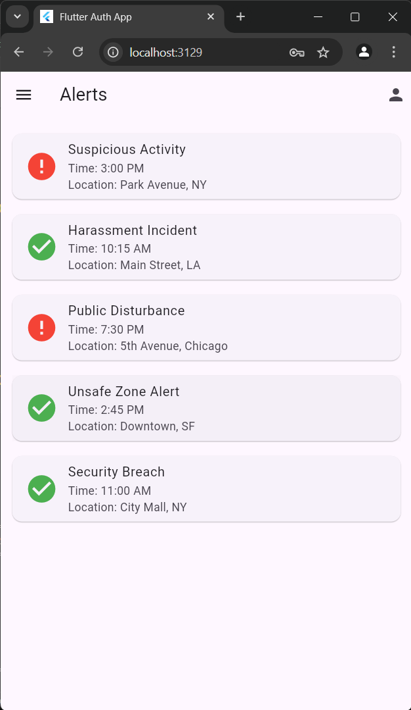 | 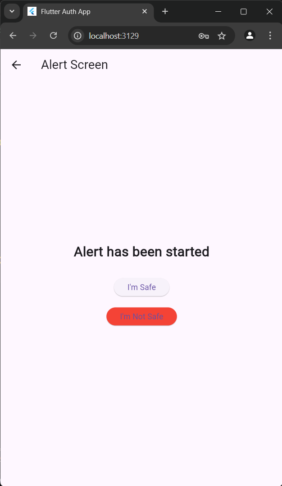 | 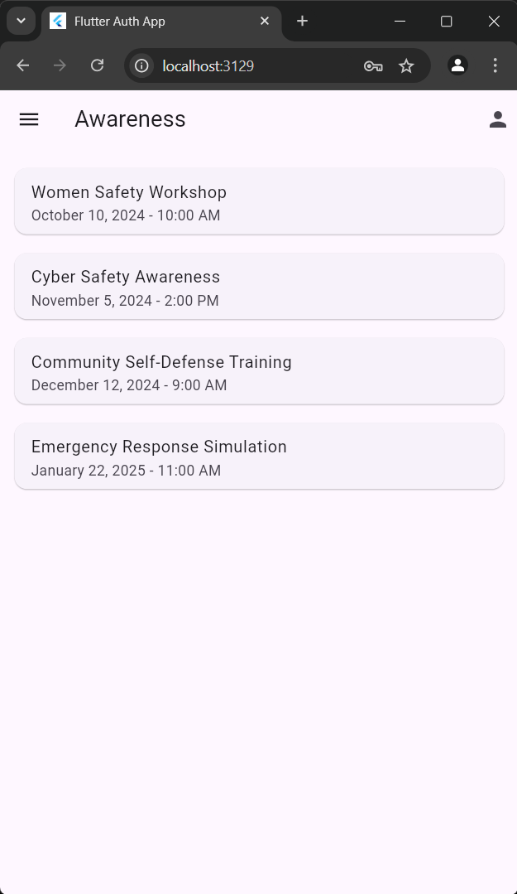 |

| Double Verification Screen                | Feedback Screen                          | Home Screen                               |
|-------------------------------------------|------------------------------------------|-------------------------------------------|
| 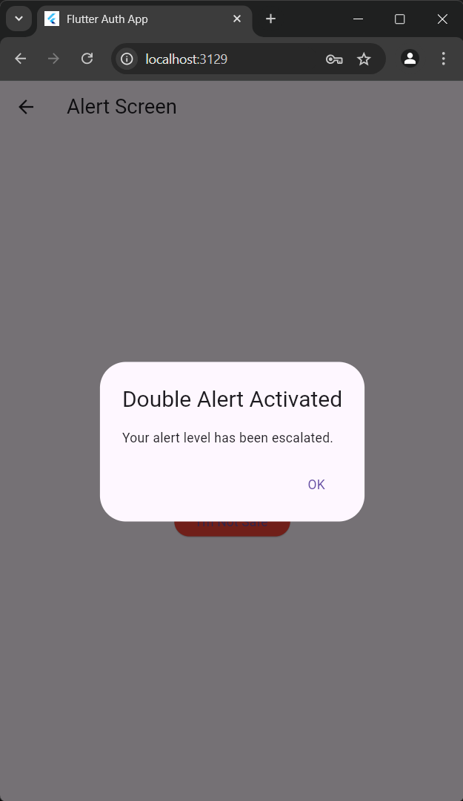 | 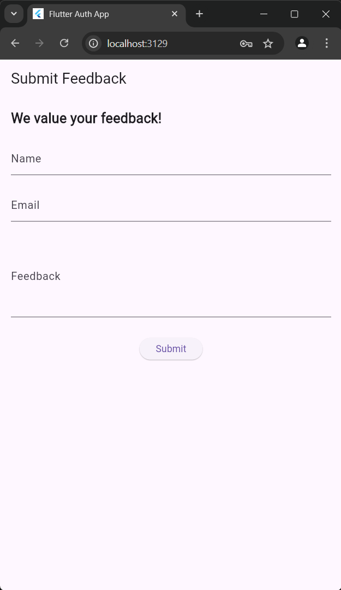 | 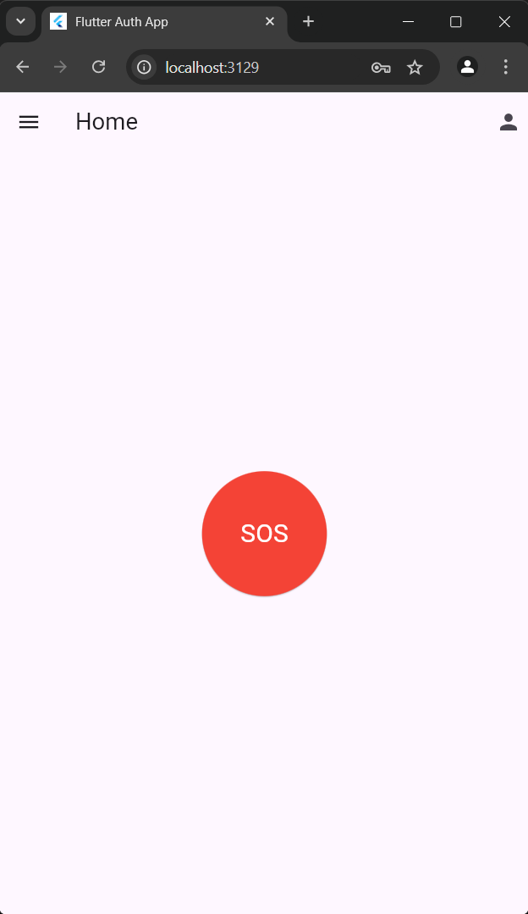 |

| Information Screen                        | Login Screen                             | Navigation Bar Screen                     |
|-------------------------------------------|------------------------------------------|-------------------------------------------|
| 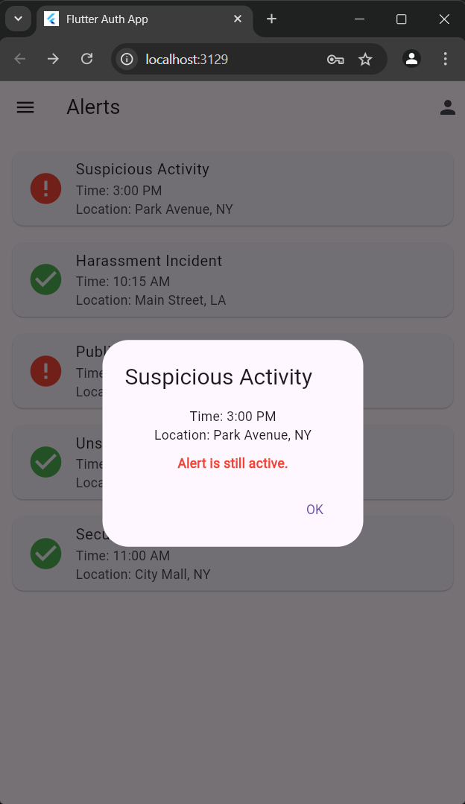 | 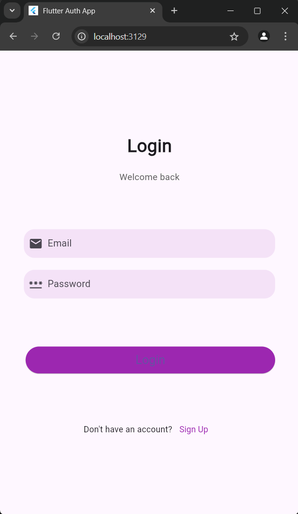 | 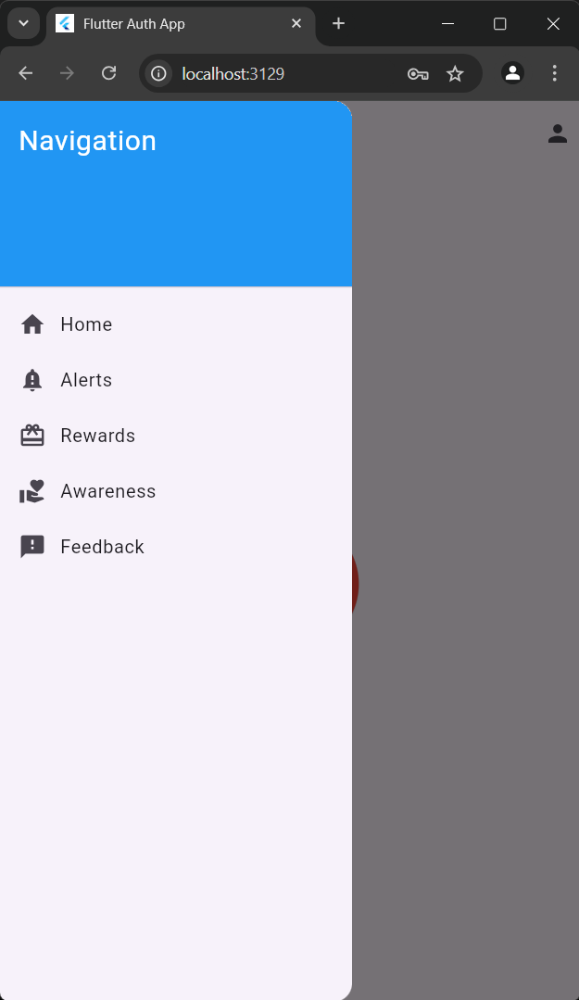 |

| PIN Screen                                | Profile Screen                           | Rewards Screen                            |
|-------------------------------------------|------------------------------------------|-------------------------------------------|
| 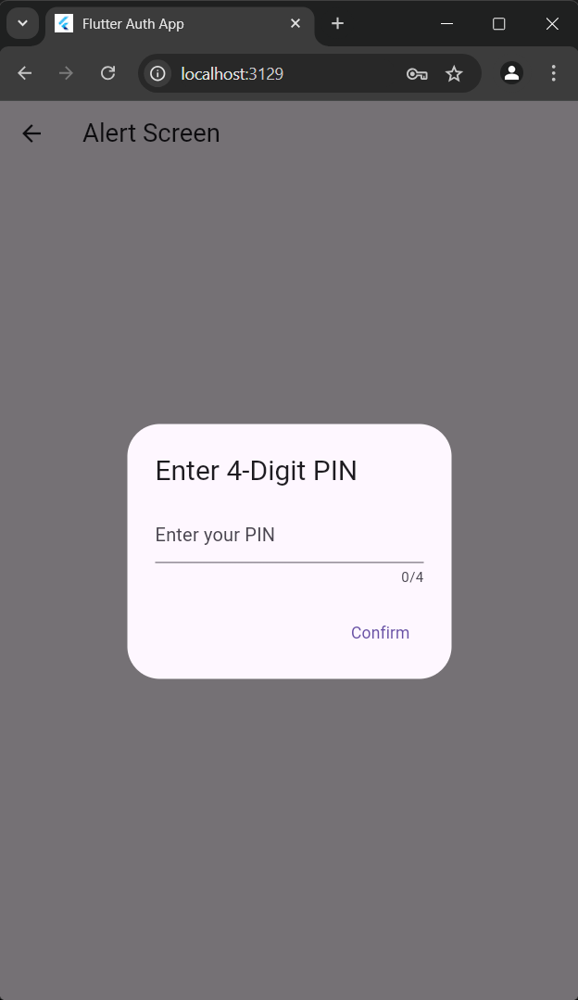 | 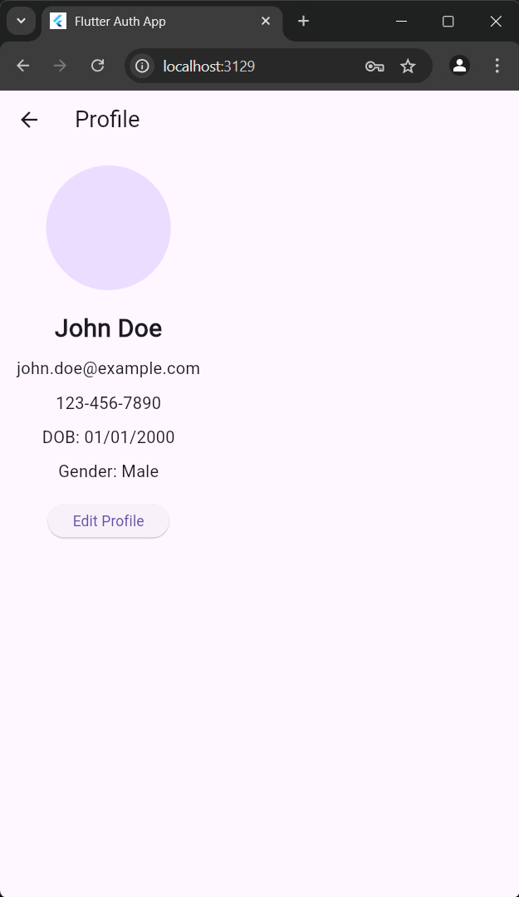 |  |

| Signup Screen                             |
|-------------------------------------------|
| 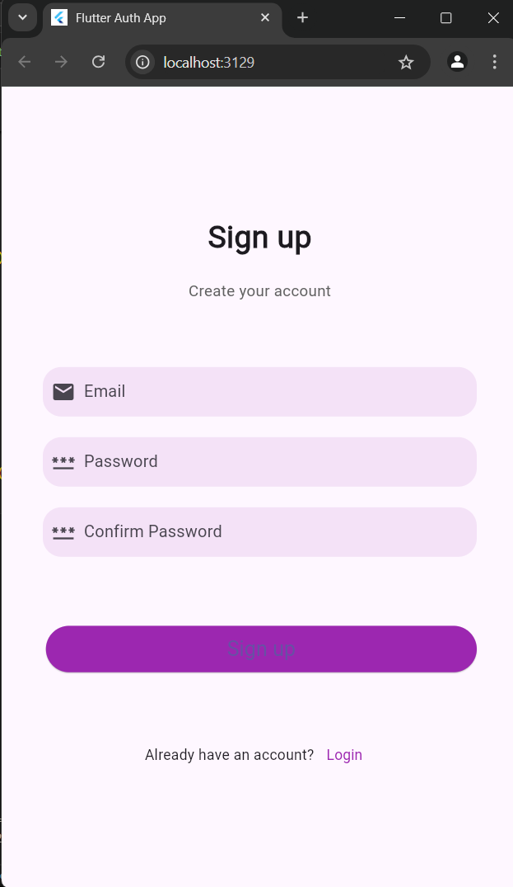  |

## Technologies Used

- **Flutter**: Cross-platform mobile app framework.
- **Dart**: Programming language used with Flutter.
- **Material Design**: UI components for consistent visual design.
- **Network Images**: To display profile pictures from web sources.

## Contributing

Contributions are welcome! To contribute:

1. Fork the repository.
2. Create a feature branch (`git checkout -b feature/your-feature-name`).
3. Commit your changes (`git commit -m 'Add a new feature'`).
4. Push to the branch (`git push origin feature/your-feature-name`).
5. Open a pull request.

## License

This project is licensed under the MIT License. See the [LICENSE](LICENSE) file for details.


